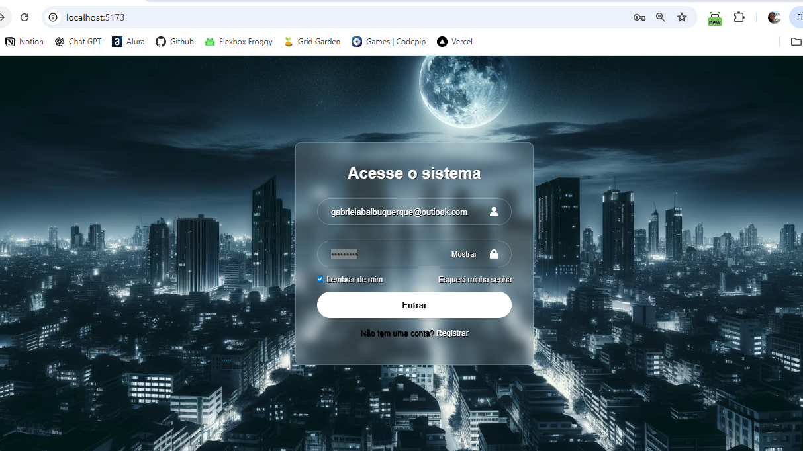

# React-Login

Formulário de login desenvolvido em **React**, com foco em boas práticas de componentização, acessibilidade, feedback visual e roteamento. O projeto foi criado para simular a tela de autenticação de uma aplicação web moderna.

## 📸 Screenshot

## 🚀 Tecnologias Utilizadas

- **React** – criação de componentes reutilizáveis e gerenciamento de estado com hooks (`useState`)
- **React Router** – implementação de rotas para navegação entre páginas (login, registro, recuperação de senha)
- **React Icons** – ícones para melhorar a usabilidade e estética dos inputs
- **CSS3** – estilização com efeitos de **glassmorphism** (fundo translúcido) e animações
- **Vite** – ferramenta para build rápido e ambiente de desenvolvimento otimizado

---

## 🛠️ Funcionalidades

✅ **Formulário de login** com campos de e-mail e senha  
✅ **Validação de dados** (e-mail válido e senha com mínimo de caracteres)  
✅ **Feedback visual de erros** com mensagens estilizadas  
✅ **Botão de mostrar/ocultar senha**  
✅ **Opção "Lembrar de mim"** (checkbox)  
✅ **Feedback de carregamento** no botão de login com **spinner animado**  
✅ **Efeito de desfoque** no formulário durante o carregamento  
✅ **Roteamento** para páginas de:

- Esqueci minha senha (`/forgot-password`)
- Registro de novo usuário (`/register`)

---

## 🎨 Interface

- Design limpo e moderno, inspirado no estilo **glassmorphism**
- Ícones intuitivos para campos de input
- Botões arredondados com transições suaves
- Foco em acessibilidade com `labels` ocultos (`sr-only`) para leitores de tela

---

## 📂 Estrutura de Componentes

- **`InputField`** → Componente genérico para inputs de texto e e-mail
- **`PasswordField`** → Componente especializado com toggle para mostrar/ocultar senha
- **`Login`** → Página principal com gerenciamento de estados e validação
- **`App`** → Layout base que organiza as rotas da aplicação

---

## 🔑 Aprendizados

Durante o desenvolvimento, foram trabalhadas as seguintes habilidades:

- Criação de **componentes reutilizáveis** e especializados
- Gerenciamento de **estado local** (`useState`)
- Implementação de **validação de formulários** em React
- Uso de **React Router** para navegação entre páginas
- Melhoria de **UX/UI** com feedback visual (spinner, mensagens de erro, efeito blur)
- Boas práticas de **acessibilidade** em formulários

---

## 📌 Próximos Passos

Integração com backend real para autenticação

Implementação de recuperação de senha

Testes unitários e de integração

🔹 Desenvolvido por Gabriela Albuquerque
